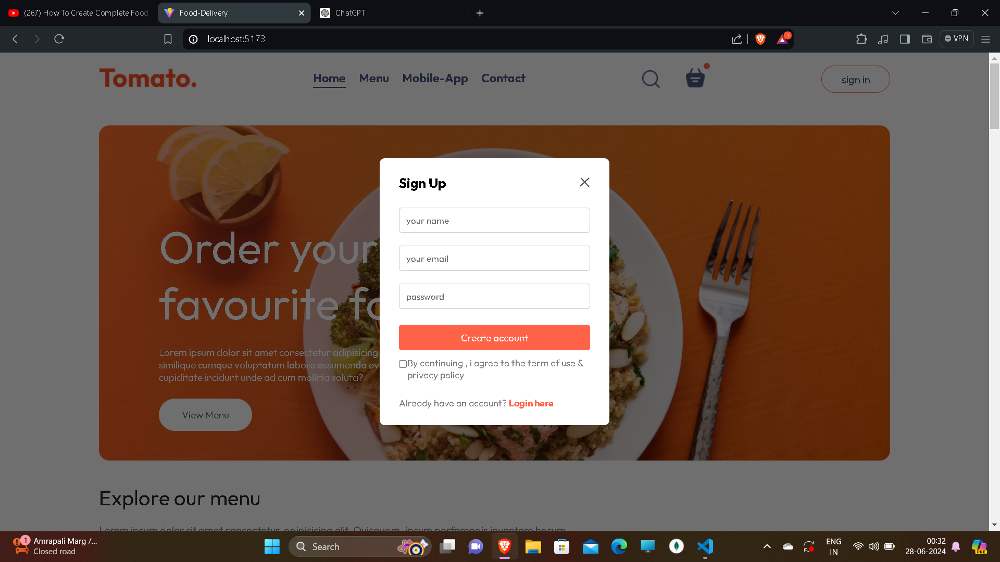
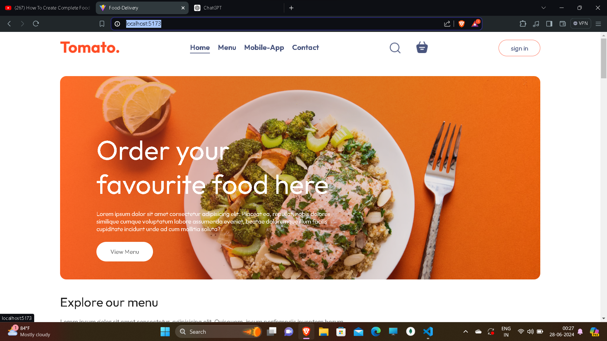
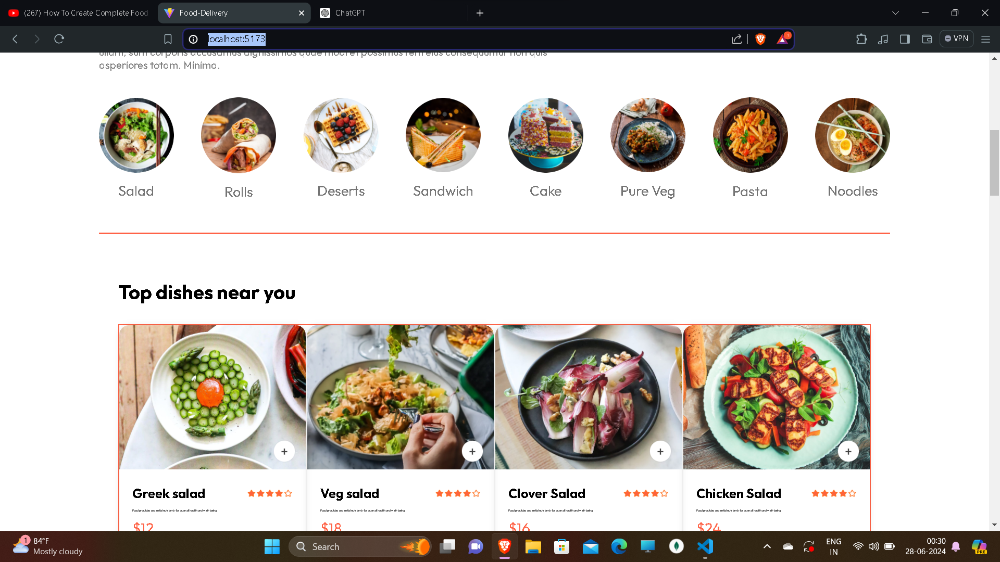
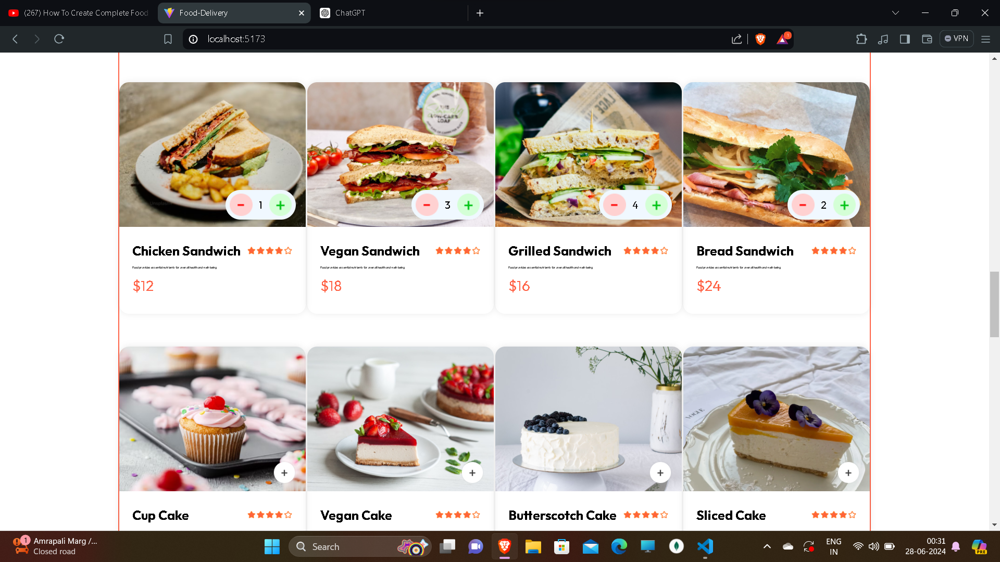
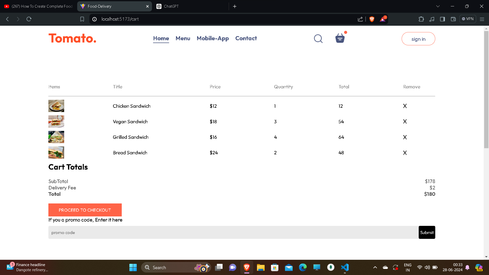
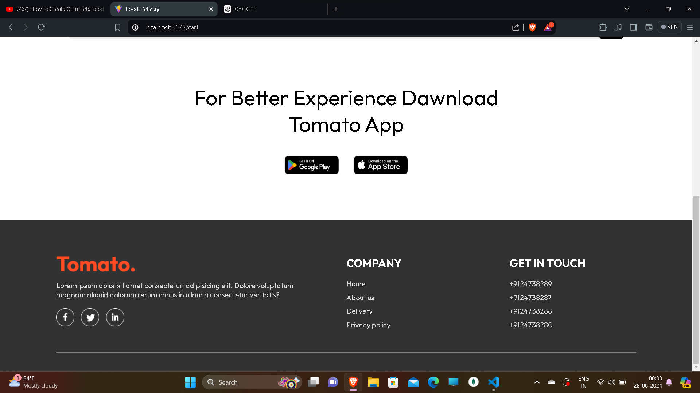

# Food-Delivery-App

our-project-name/
├── public/
│ └── dishes.json # JSON file containing dishes data and photos
├── src/
│ ├── App.jsx # Main application component
│ ├── components/
│ │ └── Header.jsx # Reusable header component
│ ├── context/
│ │ └── DishesContext.jsx # Context for managing dishes data
│ └── index.jsx # Entry point for the application
├── package.json # Project dependencies and scripts
└── README.md # Project documentation
Features

# 1. Food Recommendation

This feature suggests dishes based on the user's past selections or preferences. It utilizes the data in dishes.json to recommend items.

Implementation
Context: DishesContext.jsx manages the dishes data and user preferences.
Component: A new Recommendation.jsx component fetches and displays the recommended dishes.

# 2. Add to Cart and Remove from Cart

Users can add dishes to their cart and remove them as needed.

Implementation
Context: DishesContext.jsx maintains the cart state.
Components:
Cart.jsx: Displays the items in the cart.
DishItem.jsx: Each dish item includes an "Add to Cart" button.

# 3. Place Order

Users can place an order with the items in their cart.

Implementation
Context: DishesContext.jsx handles the order state.
Component:
PlaceOrder.jsx: Provides a summary of the order and a button to confirm the order.

